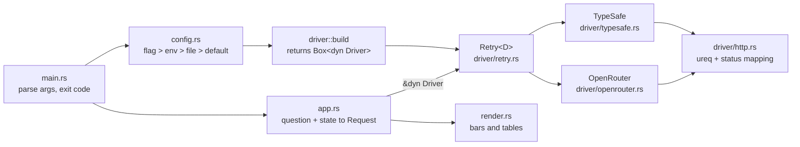

# Architecture

How hunch is put together. For the Rust concepts behind it, see the
[learning map](learning.md).

`main.rs` is the only place that touches the real world (env, stdin, stdout,
exit code). Everything else lives in the library (`lib.rs`) and is tested
without it.

| File | Role |
| ---- | ---- |
| `src/main.rs` | Parses args, builds the driver, wires stdin/stdout, maps errors to exit codes |
| `src/cli.rs` | Shape of the command line (clap derive) |
| `src/app.rs` | Validates the question, reads the state, calls the driver, picks the output |
| `src/render.rs` | Pure functions from an answer to text |
| `src/config.rs` | Layered settings resolution |
| `src/wire.rs` | Serde types for the System One request format (TypeSafe's `/v1/systemone`, OpenRouter's `/api/alpha/decisions`) |
| `src/driver/mod.rs` | `Driver` trait, `DriverKind`, `DriverError`, `build` |
| `src/driver/retry.rs` | Retry decorator |
| `src/driver/http.rs` | Shared HTTP transport and status-to-error mapping |
| `src/driver/typesafe.rs`, `openrouter.rs` | Per-provider endpoint, headers, error-body parsing |
